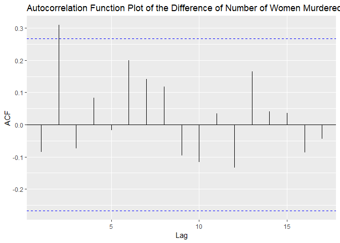
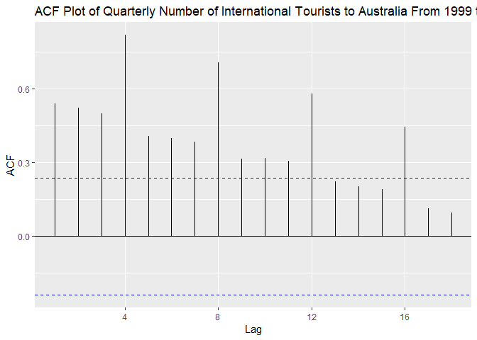

```r
knitr::opts_chunk$set(echo = TRUE)
library(fpp2)
```

```
## Loading required package: ggplot2
```

```
## Loading required package: forecast
```

```
## Loading required package: fma
```

```
## Loading required package: expsmooth
```

```r
library(ggplot2)
#library(tidyverse)
library(forecast)
#library(ets)
```


Upon initial inspection of the dataset, the time series appears to have no trend or seasonality but does have a cyclic behavior with large atypical variance. There is also no discernable trend in the data.  From this I would expect this series to be a non-stationary time series. Further analysis of the autocorrelation plot indicates a quick drop to zero, which is a clear indication of a non-stationary series. The auto.arima function selected an ARIMA(1,2,1) as the optimal model.

Investigating the differenced data using the Ljung-Box test revealed a high p-value of 0.5176, suggesting that yearly change in the murders of women is random and uncorrelated with previous years. Differencing appears to make the trend horizonatal with random variation, an indicator of stationary data. The next step to determine if the difference of the data yearly is stationary is to create an ACF plot. After printing this graph there appears to be a significant autocorrelation spike at lag 2. From this I would suggest an AR(2) or MA(2) model with a difference of 1, hence an ARIMA(0,1,2).


```r
#Print the top 5 observations in the time series data
head(wmurders)
```

```
## Time Series:
## Start = 1950 
## End = 1955 
## Frequency = 1 
## [1] 2.429415 2.363364 2.374305 2.295520 2.329716 2.233017
```

```r
#Summary statistics of the dataset
summary(wmurders)
```

```
##    Min. 1st Qu.  Median    Mean 3rd Qu.    Max. 
##   2.233   2.609   3.463   3.393   4.055   4.492
```

```r
#Plot the time series
autoplot(wmurders) + ylab('Women Murdered (per 100,000 standard population)') + xlab('Year') + ggtitle('Number of Women Murdered Each Year')
```

<!-- -->

```r
#Plot the ACF of the series
ggAcf(wmurders) + ggtitle('Autocorrelation Function Plot of the Number of Women Murdered Each Year')
```

<!-- -->

```r
#Plot the differenced data
autoplot(diff(wmurders, lag = 1)) + xlab('Year') + ggtitle('Difference of Number of Women Murdered Each Year')
```

<!-- -->

```r
#Look at the autocorrelation function (ACF) of the differenced data
Box.test(diff(wmurders), lag = 1, type = "Ljung-Box")
```

```
## 
## 	Box-Ljung test
## 
## data:  diff(wmurders)
## X-squared = 0.41871, df = 1, p-value = 0.5176
```

```r
#Plot the ACF of the differenced series
ggAcf(diff(wmurders, lag = 1)) + ggtitle('Autocorrelation Function Plot of the Difference of Number of Women Murdered Each Year')
```

<!-- -->

```r
#Plot the PACF of the differenced series to get the value of p for an AR model
ggPacf(diff(wmurders)) + ggtitle('Partial Autocorrelation Function Plot of the Difference of Number of Women Murdered Each Year')
```

<!-- -->

```r
#
```


I do not believe that this model will require a constant. Backshift operator: (1-B)*y_t

Neither ARIMA(0,1,2) nor ARIMA(2,1,0) models have an AIC value closer to zero than the ARIMA(1,2,1) model. I would recommend using the ARIMA(0,1,2) model.


```r
#Custom select variables for an ARIMA model
fit_MA2 <- Arima(wmurders, order = c(0, 1, 2))
fit_MA2
```

```
## Series: wmurders 
## ARIMA(0,1,2) 
## 
## Coefficients:
##           ma1     ma2
##       -0.0660  0.3712
## s.e.   0.1263  0.1640
## 
## sigma^2 estimated as 0.0422:  log likelihood=9.71
## AIC=-13.43   AICc=-12.95   BIC=-7.46
```

```r
#Calculate summary of the model
summary(fit_MA2)
```

```
## Series: wmurders 
## ARIMA(0,1,2) 
## 
## Coefficients:
##           ma1     ma2
##       -0.0660  0.3712
## s.e.   0.1263  0.1640
## 
## sigma^2 estimated as 0.0422:  log likelihood=9.71
## AIC=-13.43   AICc=-12.95   BIC=-7.46
## 
## Training set error measures:
##                        ME      RMSE       MAE         MPE     MAPE
## Training set 0.0007242355 0.1997392 0.1543531 -0.08224024 4.434684
##                   MASE        ACF1
## Training set 0.9491994 0.005880608
```

```r
#Check the residual error of the model
checkresiduals(fit_MA2)
```

<!-- -->

```
## 
## 	Ljung-Box test
## 
## data:  Residuals from ARIMA(0,1,2)
## Q* = 9.7748, df = 8, p-value = 0.2812
## 
## Model df: 2.   Total lags used: 10
```

```r
#Custom select variables for an ARIMA model
fit_RA2 <- Arima(wmurders, order = c(2, 1, 0))
fit_RA2
```

```
## Series: wmurders 
## ARIMA(2,1,0) 
## 
## Coefficients:
##           ar1     ar2
##       -0.0572  0.2967
## s.e.   0.1277  0.1275
## 
## sigma^2 estimated as 0.04265:  log likelihood=9.48
## AIC=-12.96   AICc=-12.48   BIC=-6.99
```

```r
#Calculate summary of the model
summary(fit_RA2)
```

```
## Series: wmurders 
## ARIMA(2,1,0) 
## 
## Coefficients:
##           ar1     ar2
##       -0.0572  0.2967
## s.e.   0.1277  0.1275
## 
## sigma^2 estimated as 0.04265:  log likelihood=9.48
## AIC=-12.96   AICc=-12.48   BIC=-6.99
## 
## Training set error measures:
##                       ME      RMSE       MAE         MPE     MAPE     MASE
## Training set 0.001232357 0.2008046 0.1544929 -0.06022595 4.436949 0.950059
##                     ACF1
## Training set 0.005925284
```

```r
#Check the residual error of the model
checkresiduals(fit_RA2)
```

<!-- -->

```
## 
## 	Ljung-Box test
## 
## data:  Residuals from ARIMA(2,1,0)
## Q* = 9.9569, df = 8, p-value = 0.2681
## 
## Model df: 2.   Total lags used: 10
```


Forecast three times ahead.


```r
#Use the forecast function and autoplot to create a plot
fit_MA2 %>% forecast(h = 3)
```

```
##      Point Forecast    Lo 80    Hi 80    Lo 95    Hi 95
## 2005       2.458450 2.195194 2.721707 2.055834 2.861066
## 2006       2.477101 2.116875 2.837327 1.926183 3.028018
## 2007       2.477101 1.979272 2.974929 1.715738 3.238464
```

```r
#Use the forecast function and autoplot to create a plot
fit_RA2 %>% forecast(h = 3)
```

```
##      Point Forecast    Lo 80    Hi 80    Lo 95    Hi 95
## 2005       2.553355 2.288694 2.818015 2.148591 2.958118
## 2006       2.533802 2.170056 2.897548 1.977501 3.090104
## 2007       2.524231 2.033825 3.014637 1.774220 3.274242
```


Plot of the series with forecasts and prediction intervals for the next three periods shown.


```r
#Use the forecast function and autoplot to create a plot
fit_MA2 %>% forecast(h = 3) %>% autoplot() + ylab('Women Murdered (per 100,000 standard population)') + xlab('Year') 
```

<!-- -->

```r
#Use the forecast function and autoplot to create a plot
fit_RA2 %>% forecast(h = 3) %>% autoplot() + ylab('Women Murdered (per 100,000 standard population)') + xlab('Year') 
```

<!-- -->


```r
#Automatically select an ARIMA model
fit_auto <- auto.arima(wmurders, seasonal = FALSE)
fit_auto
```

```
## Series: wmurders 
## ARIMA(1,2,1) 
## 
## Coefficients:
##           ar1      ma1
##       -0.2434  -0.8261
## s.e.   0.1553   0.1143
## 
## sigma^2 estimated as 0.04632:  log likelihood=6.44
## AIC=-6.88   AICc=-6.39   BIC=-0.97
```

```r
#Calculate the summary of the model
summary(fit_auto)
```

```
## Series: wmurders 
## ARIMA(1,2,1) 
## 
## Coefficients:
##           ar1      ma1
##       -0.2434  -0.8261
## s.e.   0.1553   0.1143
## 
## sigma^2 estimated as 0.04632:  log likelihood=6.44
## AIC=-6.88   AICc=-6.39   BIC=-0.97
## 
## Training set error measures:
##                       ME      RMSE       MAE        MPE     MAPE      MASE
## Training set -0.01065956 0.2072523 0.1528734 -0.2149476 4.335214 0.9400996
##                    ACF1
## Training set 0.02176343
```

```r
#Check the residual error of the model
checkresiduals(fit_auto)
```

<!-- -->

```
## 
## 	Ljung-Box test
## 
## data:  Residuals from ARIMA(1,2,1)
## Q* = 12.419, df = 8, p-value = 0.1335
## 
## Model df: 2.   Total lags used: 10
```

```r
#Use the forecast function and autoplot to create a plot
fit_auto %>% forecast(h = 3) %>% autoplot() + ylab('Women Murdered (per 100,000 standard population)') + xlab('Year') 
```

<!-- -->


```r
#Print the top 5 observations in the time series data
head(usgdp)
```

```
##        Qtr1   Qtr2   Qtr3   Qtr4
## 1947 1570.5 1568.7 1568.0 1590.9
## 1948 1616.1 1644.6
```

```r
#Summary statistics of the dataset
summary(usgdp)
```

```
##    Min. 1st Qu.  Median    Mean 3rd Qu.    Max. 
##    1568    2632    4552    5168    7130   11404
```

```r
#Plot the time series
autoplot(usgdp) + ylab('Women Murdered (per 100,000 standard population)') + xlab('Year') + ggtitle('Number of Women Murdered Each Year')
```

<!-- -->

```r
#Plot the ACF of the series
ggAcf(usgdp) + ggtitle('Autocorrelation Function Plot of the Number of Women Murdered Each Year')
```

<!-- -->

```r
#Plot the differenced data
autoplot(diff(usgdp, lag = 1)) + xlab('Year') + ggtitle('Difference of Number of Women Murdered Each Year')
```

<!-- -->

```r
#Look at the autocorrelation function (ACF) of the differenced data
Box.test(diff(usgdp), lag = 1, type = "Ljung-Box")
```

```
## 
## 	Box-Ljung test
## 
## data:  diff(usgdp)
## X-squared = 39.187, df = 1, p-value = 3.85e-10
```

```r
#Plot the ACF of the differenced series
ggAcf(diff(usgdp, lag = 1)) + ggtitle('Autocorrelation Function Plot of the Difference of Number of Women Murdered Each Year')
```

<!-- -->

```r
#Plot the PACF of the differenced series to get the value of p for an AR model
ggPacf(diff(usgdp)) + ggtitle('Partial Autocorrelation Function Plot of the Difference of Number of Women Murdered Each Year')
```

<!-- -->

```r
#
```


Fit a suitable ARIMA model to the transformed data using auto arima.


```r
#Automatically select an ARIMA model
fit_auto <- auto.arima(usgdp, seasonal = FALSE)
fit_auto
```

```
## Series: usgdp 
## ARIMA(2,2,2) 
## 
## Coefficients:
##           ar1     ar2      ma1      ma2
##       -0.1228  0.3106  -0.5835  -0.3669
## s.e.   0.2869  0.0872   0.3004   0.2862
## 
## sigma^2 estimated as 1604:  log likelihood=-1199.57
## AIC=2409.13   AICc=2409.39   BIC=2426.43
```

```r
#Calculate the summary of the model
summary(fit_auto)
```

```
## Series: usgdp 
## ARIMA(2,2,2) 
## 
## Coefficients:
##           ar1     ar2      ma1      ma2
##       -0.1228  0.3106  -0.5835  -0.3669
## s.e.   0.2869  0.0872   0.3004   0.2862
## 
## sigma^2 estimated as 1604:  log likelihood=-1199.57
## AIC=2409.13   AICc=2409.39   BIC=2426.43
## 
## Training set error measures:
##                   ME     RMSE      MAE        MPE      MAPE      MASE
## Training set 4.40617 39.54446 29.69209 0.09143455 0.6916719 0.1678117
##                     ACF1
## Training set -0.01784487
```

```r
#Check the residual error of the model
checkresiduals(fit_auto)
```

<!-- -->

```
## 
## 	Ljung-Box test
## 
## data:  Residuals from ARIMA(2,2,2)
## Q* = 8.6247, df = 4, p-value = 0.0712
## 
## Model df: 4.   Total lags used: 8
```

```r
#Use the forecast function and autoplot to create a plot
fit_auto %>% forecast(h = 20) %>% autoplot() + ylab('Women Murdered (per 100,000 standard population)') + xlab('Year') 
```

<!-- -->


We will try a few other models including: ARIMA(0,1,2), ARIMA(2,2,1), and ARIMA(1,2,2). The ARIMA(2,2,1) appears to run with the lowest AIC which is around 2408.


```r
#Custom select variables for an ARIMA model
fit1 <- Arima(usgdp, order = c(0, 1, 2))
fit1
```

```
## Series: usgdp 
## ARIMA(0,1,2) 
## 
## Coefficients:
##          ma1     ma2
##       0.4704  0.3845
## s.e.  0.0705  0.0485
## 
## sigma^2 estimated as 2297:  log likelihood=-1247.31
## AIC=2500.61   AICc=2500.72   BIC=2511.01
```

```r
#Calculate summary of the model
summary(fit1)
```

```
## Series: usgdp 
## ARIMA(0,1,2) 
## 
## Coefficients:
##          ma1     ma2
##       0.4704  0.3845
## s.e.  0.0705  0.0485
## 
## sigma^2 estimated as 2297:  log likelihood=-1247.31
## AIC=2500.61   AICc=2500.72   BIC=2511.01
## 
## Training set error measures:
##                    ME     RMSE      MAE      MPE      MAPE      MASE
## Training set 22.62492 47.61807 35.97228 0.452941 0.7913273 0.2033057
##                    ACF1
## Training set -0.1345578
```

```r
#Check the residual error of the model
checkresiduals(fit1)
```

<!-- -->

```
## 
## 	Ljung-Box test
## 
## data:  Residuals from ARIMA(0,1,2)
## Q* = 27.694, df = 6, p-value = 0.0001073
## 
## Model df: 2.   Total lags used: 8
```

```r
#Custom select variables for an ARIMA model
fit2 <- Arima(usgdp, order = c(2, 2, 1))
fit2
```

```
## Series: usgdp 
## ARIMA(2,2,1) 
## 
## Coefficients:
##          ar1     ar2      ma1
##       0.2421  0.2074  -0.9666
## s.e.  0.0664  0.0662   0.0153
## 
## sigma^2 estimated as 1606:  log likelihood=-1200.13
## AIC=2408.25   AICc=2408.43   BIC=2422.09
```

```r
#Calculate summary of the model
summary(fit2)
```

```
## Series: usgdp 
## ARIMA(2,2,1) 
## 
## Coefficients:
##          ar1     ar2      ma1
##       0.2421  0.2074  -0.9666
## s.e.  0.0664  0.0662   0.0153
## 
## sigma^2 estimated as 1606:  log likelihood=-1200.13
## AIC=2408.25   AICc=2408.43   BIC=2422.09
## 
## Training set error measures:
##                    ME     RMSE      MAE        MPE      MAPE     MASE
## Training set 4.370134 39.64392 29.71532 0.09078461 0.6963903 0.167943
##                      ACF1
## Training set -0.002150983
```

```r
#Check the residual error of the model
checkresiduals(fit2)
```

<!-- -->

```
## 
## 	Ljung-Box test
## 
## data:  Residuals from ARIMA(2,2,1)
## Q* = 9.362, df = 5, p-value = 0.09547
## 
## Model df: 3.   Total lags used: 8
```

```r
#Custom select variables for an ARIMA model
fit3 <- Arima(usgdp, order = c(1, 2, 2))
fit3
```

```
## Series: usgdp 
## ARIMA(1,2,2) 
## 
## Coefficients:
##          ar1      ma1     ma2
##       0.6539  -1.3426  0.3636
## s.e.  0.1174   0.1347  0.1277
## 
## sigma^2 estimated as 1631:  log likelihood=-1201.96
## AIC=2411.92   AICc=2412.09   BIC=2425.76
```

```r
#Calculate summary of the model
summary(fit3)
```

```
## Series: usgdp 
## ARIMA(1,2,2) 
## 
## Coefficients:
##          ar1      ma1     ma2
##       0.6539  -1.3426  0.3636
## s.e.  0.1174   0.1347  0.1277
## 
## sigma^2 estimated as 1631:  log likelihood=-1201.96
## AIC=2411.92   AICc=2412.09   BIC=2425.76
## 
## Training set error measures:
##                  ME     RMSE      MAE        MPE      MAPE      MASE
## Training set 4.3832 39.95684 29.79445 0.09037192 0.6953713 0.1683902
##                     ACF1
## Training set -0.04532914
```

```r
#Check the residual error of the model
checkresiduals(fit3)
```

<!-- -->

```
## 
## 	Ljung-Box test
## 
## data:  Residuals from ARIMA(1,2,2)
## Q* = 13.003, df = 5, p-value = 0.02335
## 
## Model df: 3.   Total lags used: 8
```


Compare the results with what you would obtain using ets with no transformation. The point forecasts, values that are mean forecasts appear to be very similar to the ARIMA(0,1,2) model. I believe that the ets model would also produce an accurate forecast.


```r
#Find the variables of the ets automatically chosen model
ets(usgdp)
```

```
## ETS(A,A,N) 
## 
## Call:
##  ets(y = usgdp) 
## 
##   Smoothing parameters:
##     alpha = 0.9999 
##     beta  = 0.278 
## 
##   Initial states:
##     l = 1557.4589 
##     b = 18.6862 
## 
##   sigma:  41.8895
## 
##      AIC     AICc      BIC 
## 3072.303 3072.562 3089.643
```


This time series has a clear positive trend from beginning to end. In addition, the time series plot also appears to have clear seasonality throughout.


```r
#Create a time series plot of the data
autoplot(austourists) + xlab("Year") + ylab("Number of International Tourists") + ggtitle("Quarterly Number of International Tourists to Australia From 1999 to 2010")
```

<!-- -->


From the autocorrelation function (ACF) graph we can learn that the largest significant spikes occur every 4 lags while all lags are slowly declining. Therefore we would want to seasonally difference the plot at the fourth lag and then add another difference.


```r
#Plot the autocorrelation function of the austourists data
ggAcf(austourists) + ggtitle("ACF Plot of Quarterly Number of International Tourists to Australia From 1999 to 2010")
```

<!-- -->


```r
#Plot the PACF model of the time series data
ggPacf(austourists) + ggtitle("PACF Plot of Quarterly Number of International Tourists to Australia From 1999 to 2010")
```

<!-- -->


This plot shows the data differenced at lag 4 and lag 1, this suggests that a moving average model of 1 be used in order to forecast. In addition, a log of the data was taken to account for the increasing variance of the seasonality.


```r
#Difference the data in order to reduce trend
austouristsdiff <- austourists %>% diff() %>% diff() %>% diff() %>% diff()
#Plot the fourth order differenced data
autoplot(austouristsdiff) + ggtitle("Fourth-Order Difference of Quarterly Number of International Tourists to Australia From 1999 to 2010 ")
```

<!-- -->


The auto arima gave me a very similar model, but it was different by a single aspect. While the auto arima produced ARIMA(1.0.1)(1,0,0)[4], the Fourth-Order Difference that I selected would be modeled as ARIMA(0,0,1)(1,0,0)[4].


```r
#Plot the fourth order differenced data
auto.arima(austouristsdiff)
```

```
## Series: austouristsdiff 
## ARIMA(3,0,0)(0,1,0)[4] 
## 
## Coefficients:
##           ar1      ar2      ar3
##       -1.7354  -1.3721  -0.3511
## s.e.   0.1199   0.1829   0.1225
## 
## sigma^2 estimated as 31.1:  log likelihood=-188.76
## AIC=385.52   AICc=386.25   BIC=393.9
```
