#### Crude Oil Prices

Read in Libraries and Data


```r
#Check to see where the current working directory is
getwd()
```

```
## [1] "C:/Users/Andrew/Desktop/Stuff for GitHub/Assignment 1"
```

```r
#Set the new working directory to the local csv file
setwd("C:/Users/Andrew/Desktop/Rockhurst University/FS18/B Term/BIA 6315 Time Series and Forecasting/Assignment 1")
#Read in the csv and define the data frame
crudeoil <- read.csv("crudeoil_w0416.csv")
#Inspect the head of the data frame
head(crudeoil)
```

```
##        date price
## 1  2-Jan-04 32.68
## 2  9-Jan-04 33.89
## 3 16-Jan-04 34.51
## 4 23-Jan-04 35.45
## 5 30-Jan-04 33.61
## 6  6-Feb-04 33.41
```

```r
#Check the summary statistics of the prices to adjust the plot
summary(crudeoil)
```

```
##        date         price       
##  1-Apr-05:  1   Min.   : 32.68  
##  1-Apr-11:  1   1st Qu.: 57.85  
##  1-Aug-08:  1   Median : 74.98  
##  1-Aug-14:  1   Mean   : 75.45  
##  1-Dec-06:  1   3rd Qu.: 94.61  
##  1-Feb-08:  1   Max.   :142.52  
##  (Other) :621
```


The Crude Oil Prices From 2004 To 2016 time series plot indicates a positive trend overall, however there are sevveral outliers towards the middle of the time period and a sudden decrease in price at the end of 2014. There is a possibility that seasonality might be a contributing factor as well but it is difficult to tell when looking at the entire window. To improve this I shrunk the window to a period that excludes the major outliers. 


```r
#Read in the csv and define the data frame
crudeoil <- read.csv("crudeoil_w0416.csv")
#Load in packages and install
library(magrittr)
library(zoo)
```

```
## 
## Attaching package: 'zoo'
```

```
## The following objects are masked from 'package:base':
## 
##     as.Date, as.Date.numeric
```

```r
library(ggplot2)
#Format the data frame date column
crudeoil$date <- as.Date(crudeoil$date, "%d-%b-%y")
#Check that class of index column is a date
class(date)
```

```
## [1] "function"
```

```r
#Use ggplot to create a time series plot with title and axis labels 
crudeoil %>%
  ggplot(aes(x = date, y = price, group = 1)) + ggtitle("Crude Oil Prices From 2004 To 2016") + geom_line() + scale_x_date(labels = function(x) format(x, "%d-%b-%y"))
```

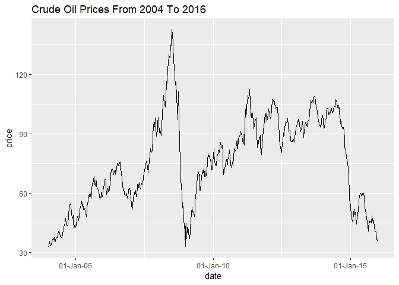<!-- -->


The percent change of oil prices over time indicate that the two areas that were percieved as outliers are also the time periods that have the greatest variation from normal price fluctuation. This is interesting and I think it would be beneficial to know where this data came from in order to search for clues as to what is causing drasttic percent changes in crude oil prices. Perhaps this could be from a government deal negotiation or war efforts in foreign countries. 


```r
#Read in the csv and define the data frame
crudeoil <- read.csv("crudeoil_w0416.csv")
#Create a zoo object using the crude oil price data 
crudeoil = zoo(crudeoil$price, as.Date(as.character(crudeoil$date), format = "%d-%b-%y"))
#Check that class of the crudeoil object is zoo
class(crudeoil)
```

```
## [1] "zoo"
```

```r
pricelag = lag(crudeoil, k = -1)
#Inspect the first few data points
head(pricelag)
```

```
## 2004-01-09 2004-01-16 2004-01-23 2004-01-30 2004-02-06 2004-02-13 
##      32.68      33.89      34.51      35.45      33.61      33.41
```

```r
#Create a manual calculation for the rate of change of price 
PriceDiff = (crudeoil - pricelag)/pricelag
#Use ggplot to create a time series plot with title and axis labels 
PriceDiff %>%
  autoplot.zoo() + ggtitle("Rate of Crude Oil Price Change") + xlab("Date") + ylab("Rate of Price Change") + scale_x_date(labels = function(x) format(x, "%d-%b-%y"))
```

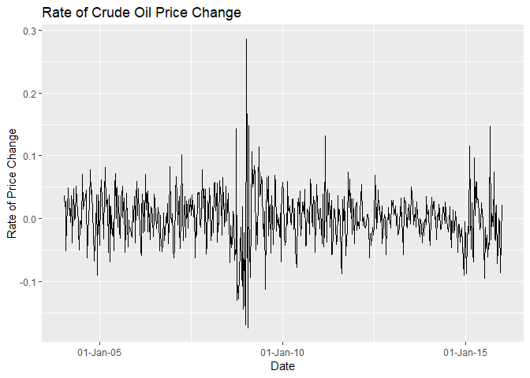<!-- -->


The Rate of Crude Oil Price Change histogram and normal Q-Q plots both indicate a slightly abnormal distribution. The distribution is weighted more negatively with a short decreasing tail on the negative side. Alternatively, the positive side of the distribution has a tail that decreases and then has an upward curve at the end. 


```r
#Plot a histogram with a title and axis labels
hist(PriceDiff, xlab = "Rate of Price Change", ylab = "Date", main = "Rate of Crude Oil Price Change Histogram")
```

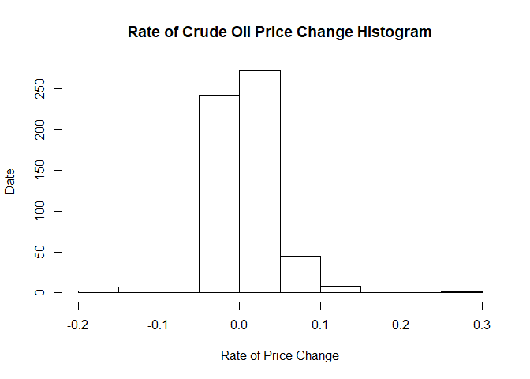<!-- -->


```r
#Plot a Normal Q-Q distribution
qqnorm(PriceDiff, main = "Percentage Change Rate of Crude Oil Price Change Normal Q-Q Plot")
#Fit a baseline to the Normal Q-Q plot
qqline(PriceDiff, col = 2)
```

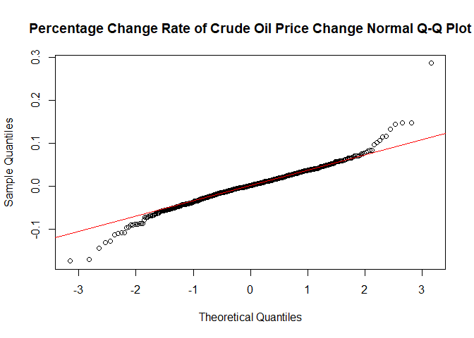<!-- -->


The Log Plot of Crude Oil Spot Prices is similar, if not identical, to the Rate of Change time series plot. This is very interesting as the manual function that was created for the rate of change is the same as the difference in log function. This would be an easy way to plot the rate of change without needing to define more variables. 


```r
#Read in the csv and define the data frame
crudeoil <- read.csv("crudeoil_w0416.csv")
#Create a zoo object using the crude oil price data 
crudeoil = zoo(crudeoil$price, as.Date(as.character(crudeoil$date), format = "%d-%b-%y"))
#Create a price lag variable
pricelag = lag(crudeoil, k = -1)
#Inspect the first few data points
head(pricelag)
```

```
## 2004-01-09 2004-01-16 2004-01-23 2004-01-30 2004-02-06 2004-02-13 
##      32.68      33.89      34.51      35.45      33.61      33.41
```

```r
#Calculate the lagging difference of the log of prices 
LogDiff = diff(log(crudeoil))
#Use ggplot to create a time series plot with title and axis labels 
LogDiff %>%
  autoplot.zoo() + ggtitle("Log of Crude Oil Price Change") + xlab("Date") + ylab("Log of Price Change") + scale_x_date(labels = function(x) format(x, "%d-%b-%y"))
```

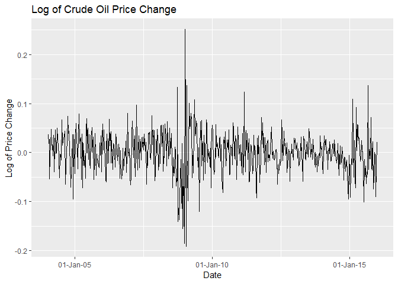<!-- -->


#### Retail Data


```r
#Read in the data set
retaildata <- readxl::read_excel("C:/Users/Andrew/Desktop/Rockhurst University/FS18/B Term/BIA 6315 Time Series and Forecasting/Assignment 1/retail.xlsx", skip=1)
#Explore the first few rows of data and different columns
head(retaildata)
```

```
## # A tibble: 6 x 190
##   `Series ID`         A3349335T A3349627V A3349338X A3349398A A3349468W
##   <dttm>                  <dbl>     <dbl>     <dbl>     <dbl>     <dbl>
## 1 1982-04-01 00:00:00      303.      41.7      63.9      409.      65.8
## 2 1982-05-01 00:00:00      298.      43.1      64        405.      65.8
## 3 1982-06-01 00:00:00      298       40.3      62.7      401       62.3
## 4 1982-07-01 00:00:00      308.      40.9      65.6      414.      68.2
## 5 1982-08-01 00:00:00      299.      42.1      62.6      404.      66  
## 6 1982-09-01 00:00:00      305.      42        64.4      412.      62.3
## # ... with 184 more variables: A3349336V <dbl>, A3349337W <dbl>,
## #   A3349397X <dbl>, A3349399C <dbl>, A3349874C <dbl>, A3349871W <dbl>,
## #   A3349790V <dbl>, A3349556W <dbl>, A3349791W <dbl>, A3349401C <dbl>,
## #   A3349873A <dbl>, A3349872X <dbl>, A3349709X <dbl>, A3349792X <dbl>,
## #   A3349789K <dbl>, A3349555V <dbl>, A3349565X <dbl>, A3349414R <dbl>,
## #   A3349799R <dbl>, A3349642T <dbl>, A3349413L <dbl>, A3349564W <dbl>,
## #   A3349416V <dbl>, A3349643V <dbl>, A3349483V <dbl>, A3349722T <dbl>,
## #   A3349727C <dbl>, A3349641R <dbl>, A3349639C <dbl>, A3349415T <dbl>,
## #   A3349349F <dbl>, A3349563V <dbl>, A3349350R <dbl>, A3349640L <dbl>,
## #   A3349566A <dbl>, A3349417W <dbl>, A3349352V <dbl>, A3349882C <dbl>,
## #   A3349561R <dbl>, A3349883F <dbl>, A3349721R <dbl>, A3349478A <dbl>,
## #   A3349637X <dbl>, A3349479C <dbl>, A3349797K <dbl>, A3349477X <dbl>,
## #   A3349719C <dbl>, A3349884J <dbl>, A3349562T <dbl>, A3349348C <dbl>,
## #   A3349480L <dbl>, A3349476W <dbl>, A3349881A <dbl>, A3349410F <dbl>,
## #   A3349481R <dbl>, A3349718A <dbl>, A3349411J <dbl>, A3349638A <dbl>,
## #   A3349654A <dbl>, A3349499L <dbl>, A3349902A <dbl>, A3349432V <dbl>,
## #   A3349656F <dbl>, A3349361W <dbl>, A3349501L <dbl>, A3349503T <dbl>,
## #   A3349360V <dbl>, A3349903C <dbl>, A3349905J <dbl>, A3349658K <dbl>,
## #   A3349575C <dbl>, A3349428C <dbl>, A3349500K <dbl>, A3349577J <dbl>,
## #   A3349433W <dbl>, A3349576F <dbl>, A3349574A <dbl>, A3349816F <dbl>,
## #   A3349815C <dbl>, A3349744F <dbl>, A3349823C <dbl>, A3349508C <dbl>,
## #   A3349742A <dbl>, A3349661X <dbl>, A3349660W <dbl>, A3349909T <dbl>,
## #   A3349824F <dbl>, A3349507A <dbl>, A3349580W <dbl>, A3349825J <dbl>,
## #   A3349434X <dbl>, A3349822A <dbl>, A3349821X <dbl>, A3349581X <dbl>,
## #   A3349908R <dbl>, A3349743C <dbl>, A3349910A <dbl>, A3349435A <dbl>,
## #   A3349365F <dbl>, A3349746K <dbl>, ...
```


```r
#Define my time series object as myts and specify the value to be explored
myts <- ts(retaildata[,"A3349910A"],
  frequency=12, start=c(1982,4))
```


  From the autoplot of the time series, it is clear that the value of A3349910A is increasing since the beginning of its time. In addition, this increasing trend appears to fit closely to an exponentially increasing curve rather than a linearly increasing line. Plotting the A3349910A values with respect to their corresponding dates in a year over year seasonal plot reveals increasing seasonality of values. As the year approaches the current date, seasonal effects can be seen because the variation increases. From the Retail Seasonal Plot we can see that values tend to spike every other month in a cyclical nature. 
  From the Retail Seasonal Subseries Plot we see that although there is seasonality. it is very minimal as the mean hardly changes from month to month. The Retail Correlogram resulted in large, positive autocorrelation values. However, the seasonal lags are hardly apparent from the plot which indicates that further testing would be needed to conclusively say that there is seasonality.


```r
#Autoplot the retail data
myts %>%
  autoplot.zoo()  + ggtitle("Retail Autoplot")
```

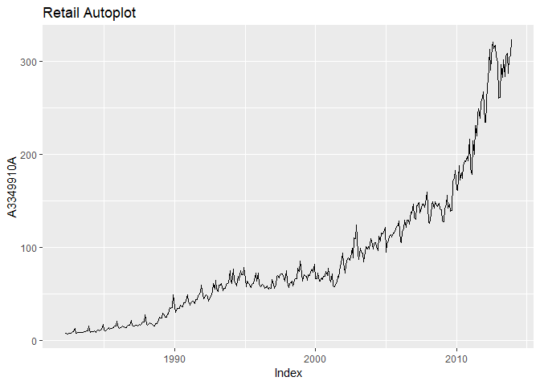<!-- -->

```r
#Load the forecast library
library(forecast)
#Check for seasonality and cyclicality 
ggseasonplot(myts)  + ggtitle("Retail Seasonal Plot")
```

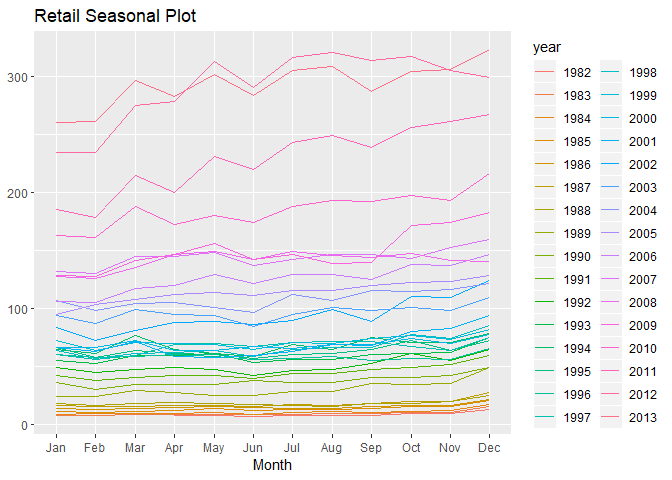<!-- -->

```r
ggseasonplot(myts, polar = TRUE)  + ggtitle("Retail Seasonal Plot")
```

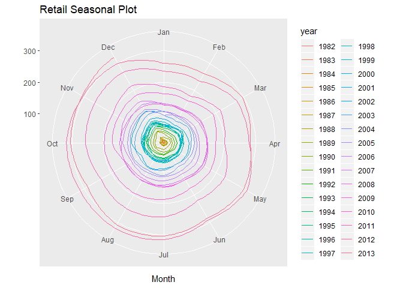<!-- -->

```r
#Subseries plot
ggsubseriesplot(myts)  + ggtitle("Retail Seasonal Subseries Plot")
```

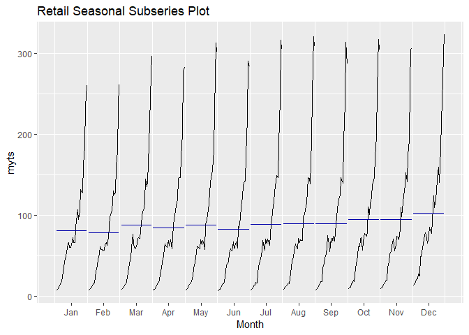<!-- -->

```r
#Lag plot
gglagplot(myts)  + ggtitle("Retail Lag Plot")
```

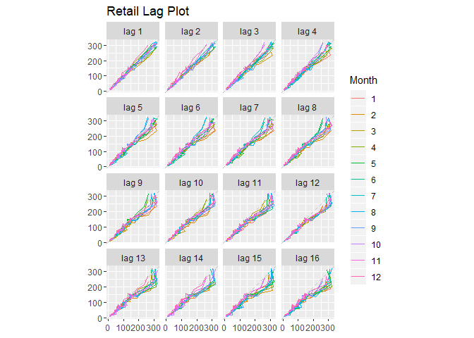<!-- -->

```r
#Acf plot
ggAcf(myts)  + ggtitle("Retail Correlogram")
```

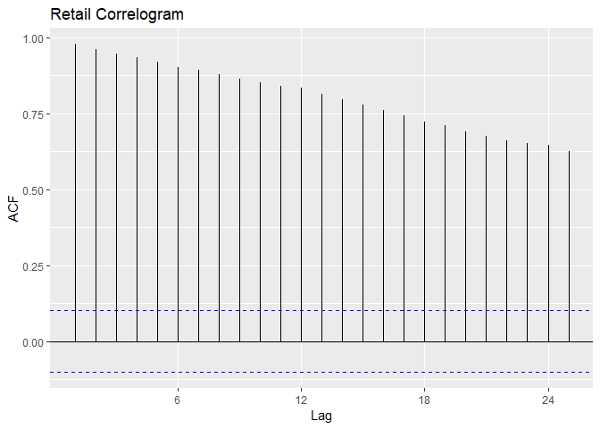<!-- -->
