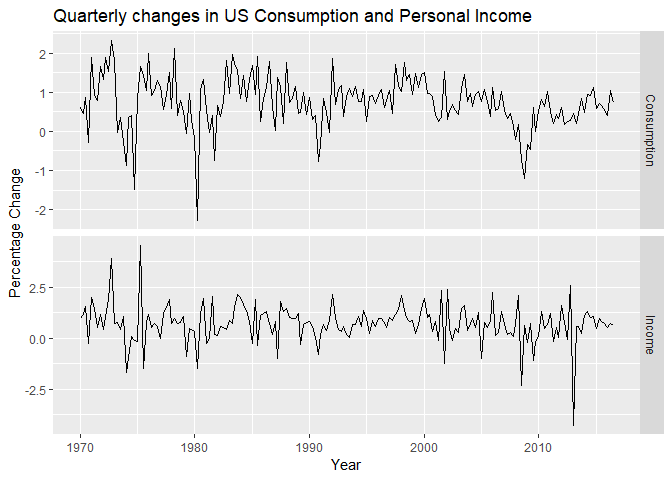

```r
knitr::opts_chunk$set(echo = TRUE)
library(fpp2)
library(ggplot2)
# library(tidyverse)
library(forecast)
library(openxlsx)
library(readxl)
```


An ARIMA(1,0,2) was identified as the optimal model using the auto.arima function where the fitted model n_t = (0.692n_t-1 + e_t - 0.576e_t-1 + 0.198e_t-2) minimises the sum of squared error values. The initial plot of the percentage difference in quartely personal consumption expenditure and personal disposable income indicates that the data are stationary, therefore there is no need for differencing.  From the residuals plot we can tell that the are not much different from white noise and can most likely be considered as such. 

B_1 and B_2 are both positive beta parameters and therefore tell us they are positively correlated to the predicted variable. The estimates of B_1 and B_2 are 0.0077, and 0.0208 respectively and both have P-values of 0.000. Their P-values do not indicate a significant effect, therefore they are both weighted lightly and the white noise error is what makes up the majority of the electricity consumption. 


```r
# Plot the initial time series
autoplot(uschange[, 1:2], facets = TRUE) + xlab("Year") + ylab("Percentage Change") + 
    ggtitle("Quarterly changes in US Consumption and Personal Income")
```

<!-- -->

```r
# Fit the time series using auto ARIMA function
fit <- auto.arima(uschange[, "Consumption"], xreg = uschange[, "Income"])
fit
```

```
## Series: uschange[, "Consumption"] 
## Regression with ARIMA(1,0,2) errors 
## 
## Coefficients:
##          ar1      ma1     ma2  intercept    xreg
##       0.6922  -0.5758  0.1984     0.5990  0.2028
## s.e.  0.1159   0.1301  0.0756     0.0884  0.0461
## 
## sigma^2 estimated as 0.3219:  log likelihood=-156.95
## AIC=325.91   AICc=326.37   BIC=345.29
```

```r
# Check the residuals of the ARIMA model
checkresiduals(fit)
```

<!-- -->

```
## 
## 	Ljung-Box test
## 
## data:  Residuals from Regression with ARIMA(1,0,2) errors
## Q* = 5.8916, df = 3, p-value = 0.117
## 
## Model df: 5.   Total lags used: 8
```


This model could be used to forecast electricity demand for the next twelve months by using an ARIMA model and looking at the mean forecast similar to the one below.

The n_t term should be modelled with an ARIMA model rather than with a standard regression model because the ARIMA model minimizes the error estimate in the model. The n_t model is important in producing forecasts because it is a key to the system of equations that predicts the percentage change.


```r
# Produce a forecast of the fitted model
fcast <- forecast(fit, xreg = rep(mean(uschange[, 2]), 8))

# Plot the forecast of the model to display
autoplot(fcast) + xlab("Year") + ylab("Percentage change")
```

<!-- -->


Below I developed an appropriate dynamic regression model with Fourier terms for the seasonality. I used the AIC to select the number of Fourier terms to include in the model, based on the previous Box-Cox transformation.


```r
# Change the working directory to the location of the dataset
setwd("E:/Rockhurst University/FS18/B Term/BIA 6315 Time Series and Forecasting/Assignment 4")
getwd()
```

```
## [1] "E:/Rockhurst University/FS18/B Term/BIA 6315 Time Series and Forecasting/Assignment 4"
```

```r
# Load in the dataset
retail <- read_excel("retail.xlsx", sheet = 1, skip = 1)
# Define the time series data and format periods
retail.ts <- ts(retail[, "A3349873A"], frequency = 12, start = c(1982, 4))
# Plot the time series with appropriate axis and title labels
autoplot(retail.ts) + xlab("Year") + ylab("Turnover") + ggtitle("Retail Turnover in New South Wales")
```

<!-- -->

```r
# Define the lambda value from the Box-Cox transformation
lambda_retail <- BoxCox.lambda(retail.ts)

# Select the number of Fouriers
min.AIC <- Inf
K_min.AIC <- 0

for (num in c(1:6)) {
    retail.ts_tslm <- tslm(retail.ts ~ trend + fourier(retail.ts, K = num), 
        lambda = lambda_retail)
    
    AIC <- CV(retail.ts_tslm)["AIC"]
    
    if (AIC < min.AIC) {
        min.AIC <- AIC
        K_min.Aic <- num
    }
}

# Harmonic regression model
retail.ts_tslm <- tslm(retail.ts ~ trend + fourier(retail.ts, K = K_min.Aic), 
    lambda = lambda_retail)
autoplot(retail.ts) + autolayer(retail.ts_tslm$fitted.values) + xlab("Year") + 
    ylab("Turnover") + ggtitle("Harmonic Regression Model of Retail Turnover in New South Wales")
```

<!-- -->

```r
# Dynamic regression model
retail.ts_autoarima <- auto.arima(retail.ts, lambda = lambda_retail, xreg = cbind(Fourier = fourier(retail.ts, 
    K = K_min.Aic), time = time(retail.ts)))
retail.ts_autoarima
```

```
## Series: retail.ts 
## Regression with ARIMA(1,0,3)(1,0,1)[12] errors 
## Box Cox transformation: lambda= 0.1276369 
## 
## Coefficients:
##          ar1      ma1      ma2     ma3    sar1     sma1  intercept
##       0.9585  -0.3508  -0.1512  0.0923  0.6126  -0.2497  -200.2360
## s.e.  0.0180   0.0591   0.0562  0.0532  0.1203   0.1306    22.3544
##       Fourier.S1-12  Fourier.C1-12  Fourier.S2-12  Fourier.C2-12
##             -0.2285        -0.0696         0.0824        -0.1537
## s.e.         0.0164         0.0164         0.0119         0.0119
##       Fourier.S3-12  Fourier.C3-12  Fourier.S4-12  Fourier.C4-12
##              0.1523         0.0448        -0.0407         0.1213
## s.e.         0.0113         0.0115         0.0102         0.0101
##       Fourier.S5-12  Fourier.C5-12  Fourier.C6-12    time
##             -0.1309         0.0078        -0.0383  0.1040
## s.e.         0.0083         0.0083         0.0051  0.0112
## 
## sigma^2 estimated as 0.009255:  log likelihood=358.78
## AIC=-677.56   AICc=-675.23   BIC=-598.71
```

```r
autoplot(retail.ts) + autolayer(retail.ts_autoarima$fitted) + xlab("Year") + 
    ylab("Turnover") + ggtitle("Dynamic Regression Model of Retail Turnover in New South Wales")
```

<!-- -->


After checking the residuals from both the harmonic regression model and the ARIMA model, the ARIMA model appears to look more similar to white noise. I would recommend using the ARIMA model to forecast. 


```r
# Auto ARIMA model residuals
checkresiduals(retail.ts_autoarima)
```

<!-- -->

```
## 
## 	Ljung-Box test
## 
## data:  Residuals from Regression with ARIMA(1,0,3)(1,0,1)[12] errors
## Q* = 20.823, df = 5, p-value = 0.0008748
## 
## Model df: 19.   Total lags used: 24
```

```r
# Harmonic regression model residuals
checkresiduals(retail.ts_tslm)
```

<!-- -->

```
## 
## 	Breusch-Godfrey test for serial correlation of order up to 24
## 
## data:  Residuals from Linear regression model
## LM test = 342.56, df = 24, p-value < 2.2e-16
```


The resulting model appears to indicate that the ARIMA model is optimal. Based on this, I would suggest using the ARIMA(1,0,3)(1,0,1)[12] model to forecast.


```r
# Change the working directory to the location of the dataset
setwd("E:/Rockhurst University/FS18/B Term/BIA 6315 Time Series and Forecasting/Assignment 4")
getwd()
```

```
## [1] "E:/Rockhurst University/FS18/B Term/BIA 6315 Time Series and Forecasting/Assignment 4"
```

```r
# Load in the comparing dataset
retail.new <- read_excel("8501011.xlsx", sheet = "Data1", skip = 9)
retail.new.ts <- ts(retail.new[, "A3349873A"], start = c(1982, 4), frequency = 12)
retail.new.test <- subset(retail.new.ts, start = length(retail.ts) + 1)

# Make a variable which takes future values
t <- time(retail.ts)
xreg.new = cbind(Fourier = fourier(retail.ts, K = K_min.Aic, h = 36), time = t[length(t)] + 
    seq(36)/12)

# Forecast 36 periods
fc_retail.ts_autoarima <- forecast(retail.ts_autoarima, h = 36, xreg = xreg.new)
autoplot(fc_retail.ts_autoarima)
```

<!-- -->

```r
accuracy(fc_retail.ts_autoarima, retail.new.test)
```

```
##                      ME     RMSE      MAE          MPE      MAPE      MASE
## Training set  0.2036433 13.68484  8.35041 -0.005331387  3.498037 0.4410176
## Test set     55.9767920 65.56371 56.74087 10.462750748 10.572738 2.9967056
##                    ACF1 Theil's U
## Training set -0.1321453        NA
## Test set      0.2417374  1.157974
```
