```r
knitr::opts_chunk$set(echo = TRUE)
library(fpp2)
library(ggplot2)
# library(tidyverse)
library(forecast)
library(openxlsx)
library(readxl)
library(hts)
```


The initial plot of the aggregate-level view of the hierarchical time series appears to be very seasonal. Upon inspection of level 1 of the hirachical time series, the total number of nights stayed in Australia by tourists grouped by state, we notice that the NSW region is has the largest amount of visitors. The data at level one also appears to follow a similar trend as the aggregate-level view of the total nights stayed in Australia. I am satisfied with these forecasts, they appear to follow a striking similarity to the seasonal patterns observed in the hierarchy.


```r
# Define the hierarchical time series
tourism.hts <- hts(visnights, characters = c(3, 5))

# Plot the hierarchical time series object
tourism.hts %>% aggts(levels = 0:1) %>% autoplot(facet = TRUE) + xlab("Year") + 
    ylab("Millions") + ggtitle("Visitor Nights")
```

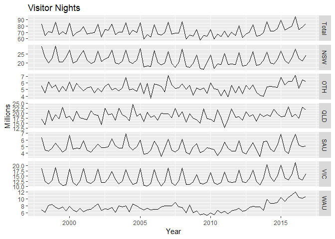<!-- -->

```r
# Forecast ARIMA model
fc_visnights_arima <- forecast(tourism.hts, h = 8, method = "bu", fmethod = "arima")

# Plot the coherent forecasts by level
plot(fc_visnights_arima, levels = 0:1, color_lab = TRUE)
title(main = "Total Visitor Nights in Australia
      ")
```

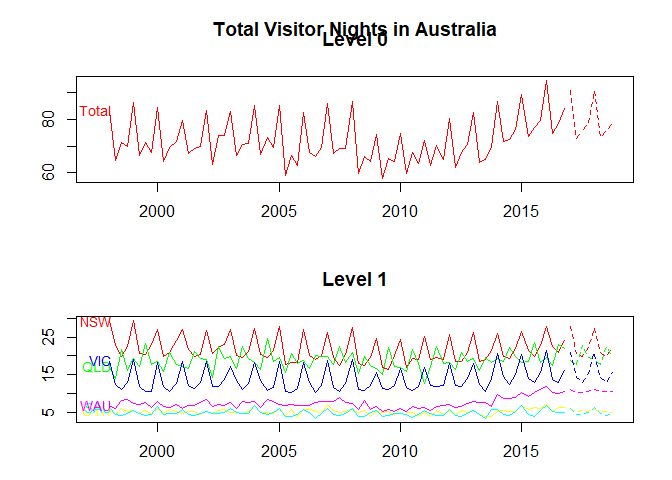<!-- -->


Similar to above, the aggregate level shows strong seasonality and forecasted values appear to be on a negative trend. NSW also had the most total visitors. NSW, VIC, and QLD all have seasonality while the rest of the visitor nights by state group do not have a clear seasonal pattern. The second level forecast indicates that the QLDMetro State Zone has more tourism than any other state zone. This is an interesting feature of the series becauase the state zone that is the highest at level two ranks number three in highest total visitor nights for the level 1 aggregated series which is by state zone.


```r
# Define the hierarchical time series
tourism.hts <- hts(visnights, characters = c(3, 5))

# Forecast ARIMA model
fc_visnights_arima <- forecast(tourism.hts, h = 8, method = "bu", fmethod = "arima")

# Plot the coherent forecasts by level
plot(fc_visnights_arima, levels = 0)
title(main = "Total Visitor Nights in Australia")
```

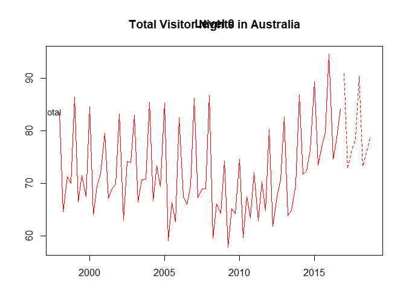<!-- -->

```r
# Plot the coherent forecasts by level
plot(fc_visnights_arima, levels = 1)
title(main = "Total Visitor Nights in Australia by State Group")
```

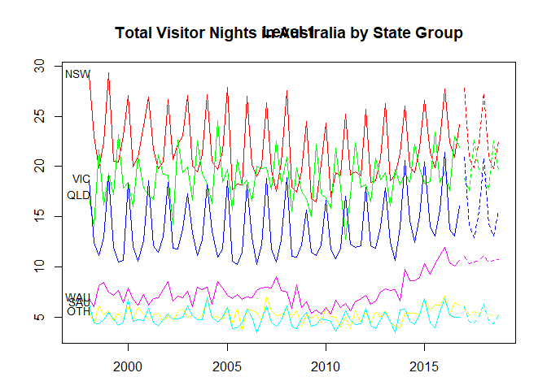<!-- -->

```r
# Plot the coherent forecasts by level
plot(fc_visnights_arima, levels = 2)
title(main = "Total Visitor Nights in Australia by State Zone")
```

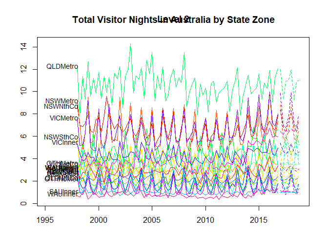<!-- -->


This forecast is different than the one from above in many ways. MinT was chosen as a parameter in order to minimize the weights. The sample "sam" covariance parameter was chosen because the number of time periods was greater than the number of rows being analyzed in the heirarchical time series structure. Upon inspection of the state zone and state group forecasts, the values appear to be greater for the optimally reconciled forecast than for the ARIMA forecast. Counterintuitively, the aggregate-level series of the total visitor nights stayed in Australia reveals that the optimally reconciled forecast values are greater than those of the bottom-up ARIMA forecast.


```r
str(visnights)
```

```
##  Time-Series [1:76, 1:20] from 1998 to 2017: 9.05 6.96 6.87 7.15 7.96 ...
##  - attr(*, "dimnames")=List of 2
##   ..$ : NULL
##   ..$ : chr [1:20] "NSWMetro" "NSWNthCo" "NSWSthCo" "NSWSthIn" ...
```

```r
str(smatrix(tourism.hts))
```

```
##  num [1:27, 1:20] 1 1 0 0 0 0 0 1 0 0 ...
##  - attr(*, "dimnames")=List of 2
##   ..$ : NULL
##   ..$ : NULL
```

```r
# Produce the optimally reconciled forecast
fc_visnights_arima_opt <- tourism.hts %>% forecast(h = 8, method = "comb", weights = "mint", 
    covariance = "sam", fmethod = "arima")

# Plot the optimally reconciled and bottom-up forecasts
plot(fc_visnights_arima_opt, levels = 0, col = "Blue")
par(new = TRUE, xpd = TRUE)
plot(fc_visnights_arima, levels = 0, col = "Green")
title(main = "Total Visitor Nights in Australia")
legend("bottomright", legend = c("Optimal", "Bottom-Up"), title = "Coherent Forecast", 
    col = c("Blue", "Green"), lty = c(1, 1), bty = "n", cex = 0.5)
```

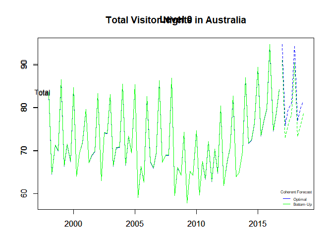<!-- -->

```r
# Plot the optimally reconciled forecast level 1
plot(fc_visnights_arima_opt, levels = 1, color_lab = TRUE)
title(main = "Optimally Reconciled Forecasts of Total Visitor Nights in Australia by State Group")
```

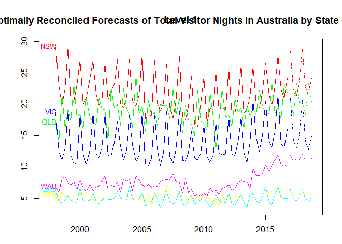<!-- -->

```r
# Plot the ARIMA forecast level 1
plot(fc_visnights_arima, levels = 1, color_lab = TRUE)
title(main = "ARIMA Forecasts of Total Visitor Nights in Australia by State Group")
```

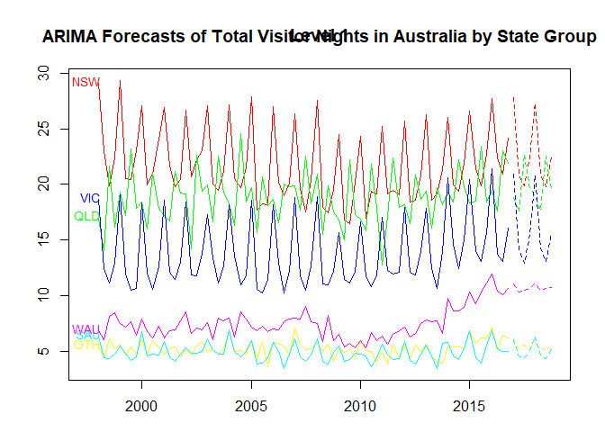<!-- -->

```r
# Plot the optimally reconciled forecast level 2
plot(fc_visnights_arima_opt, levels = 2, color_lab = TRUE)
title(main = "Optimally Reconciled Forecasts of Total Visitor Nights in Australia by State Zone")
```

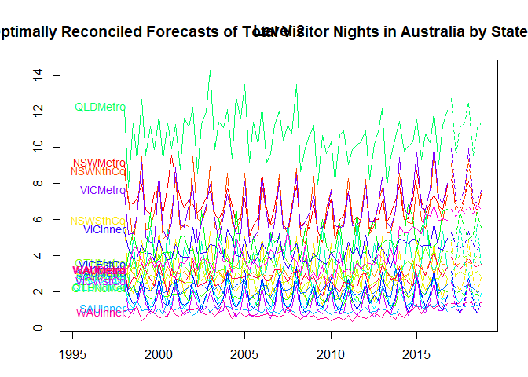<!-- -->

```r
# Plot the ARIMA forecast level 2
plot(fc_visnights_arima, levels = 2, color_lab = TRUE)
title(main = "ARIMA Forecasts of Total Visitor Nights in Australia by State Zone")
```

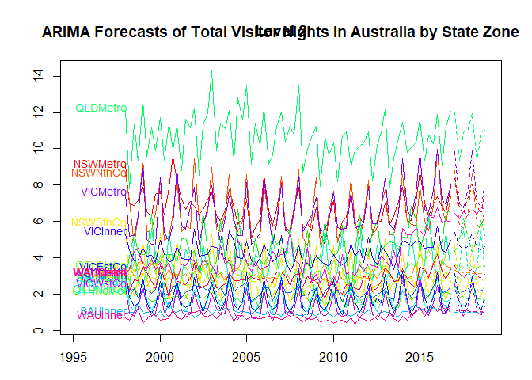<!-- -->


Using the last two years of the visnights Australian domestic tourism data as a test set, I generate bottom-up, top-down, and optimally reconciled forecasts for this period and compare their accuracy.


```r
visnights %>% head()
```

```
##         NSWMetro NSWNthCo NSWSthCo NSWSthIn NSWNthIn  QLDMetro QLDCntrl
## 1998 Q1 9.047095 8.565678 5.818029 2.679538 2.977507 12.106052 2.748374
## 1998 Q2 6.962126 7.124468 2.466437 3.010732 3.477703  7.786687 4.040915
## 1998 Q3 6.871963 4.716893 1.928053 3.328869 3.014770 11.380024 5.343964
## 1998 Q4 7.147293 6.269299 2.797556 2.417772 3.757972  9.311460 4.260419
## 1999 Q1 7.956923 9.493901 4.853681 3.224285 3.790760 12.671942 4.186113
## 1999 Q2 6.542243 5.401201 2.759843 2.428489 3.395284  9.582965 4.237806
##         QLDNthCo SAUMetro SAUCoast  SAUInner VICMetro  VICWstCo VICEstCo
## 1998 Q1 2.137234 2.881372 2.591997 0.8948773 7.490382 2.4420048 3.381972
## 1998 Q2 2.269596 2.124736 1.375780 0.9792509 5.198178 0.9605047 1.827940
## 1998 Q3 4.890227 2.284870 1.079542 0.9803289 5.244217 0.7559744 1.351952
## 1998 Q4 2.621548 1.785889 1.497664 1.5094343 6.274246 1.2716040 1.493415
## 1999 Q1 2.483203 2.293873 2.247684 0.9635227 9.187422 2.3850583 2.896929
## 1999 Q2 3.377830 2.197418 1.672802 0.9968803 4.992303 1.3288638 1.547901
##         VICInner WAUMetro WAUCoast  WAUInner OTHMetro OTHNoMet
## 1998 Q1 5.326655 3.075779 3.066555 0.6949954 3.437924 2.073469
## 1998 Q2 4.441119 2.154929 3.334405 0.5576796 2.677081 1.787939
## 1998 Q3 3.815645 2.787286 4.365844 1.0061844 3.793743 2.345021
## 1998 Q4 3.859567 2.752910 4.521996 1.1725514 3.304231 1.943689
## 1999 Q1 4.588755 3.519564 3.579347 0.3981829 3.510819 2.165838
## 1999 Q2 4.070401 3.160430 3.408533 0.5960182 2.871867 1.803940
```

```r
# Define the train set
tourism.hts.train <- window(tourism.hts, end = c(2014, 4))
# Define the test set
tourism.hts.test <- window(visnights, start = 2015)

# Produce the optimally reconciled forecast
fc_visnights_test_arima_opt <- forecast(tourism.hts.train, h = 8, method = "comb", 
    weights = "wls", fmethod = "arima")
# Produce the bottom-up forecast
fc_visnights_test_arima_bu <- forecast(tourism.hts.train, h = 8, method = "comb", 
    weights = "wls", fmethod = "arima")
# Produce the top-down forecast

# Plot the optimally reconciled and bottom-up forecasts
plot(fc_visnights_test_arima_opt, levels = 0, col = "Blue")
par(new = TRUE, xpd = TRUE)
plot(fc_visnights_test_arima_bu, col = "Green")
```

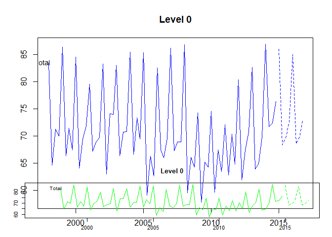<!-- -->

```r
title(main = "Total Visitor Nights in Australia")
legend("bottomright", legend = c("Optimal", "Bottom-Up"), title = "Coherent Forecast", 
    col = c("Blue", "Green"), lty = c(1, 1), bty = "n", cex = 0.5)
```

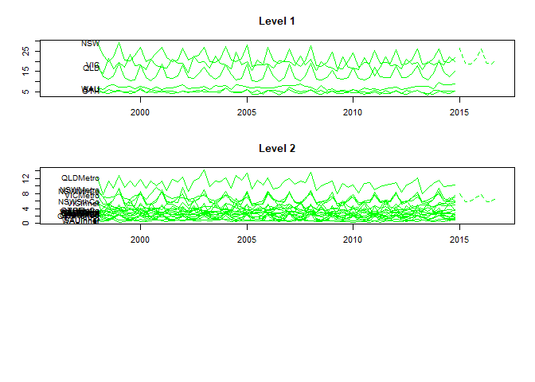<!-- -->


The initial time series of the retail dataset appears to have a strong seasonality and an increasing trend. The residuals do not appear to resemble white noise but the forecast appears to follow similar seasonality and trend. The forecasted values might be higher than expected but they seem close.


```r
# Change the working directory to the location of the dataset
getwd()
```

```
## [1] "C:/Users/Andrew/Desktop/Stuff for GitHub/Final Project"
```

```r
setwd("E:/Rockhurst University/FS18/B Term/BIA 6315 Time Series and Forecasting/Final Project")

# Load in the dataset
retail <- read_excel("retail.xlsx", sheet = 1, skip = 1)
# Define the time series data and format periods
retail.ts <- ts(retail[, "A3349873A"], frequency = 12, start = c(1982, 4))
# Plot the time series with appropriate axis and title labels
autoplot(retail.ts) + xlab("Year") + ylab("Turnover") + ggtitle("Retail Turnover in New South Wales")
```

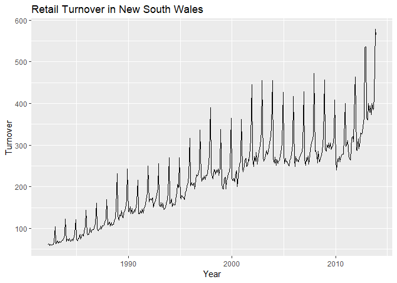<!-- -->

```r
# Apply the TBATS function to the retail time series
retail.ts %>% tbats() %>% forecast() %>% autoplot() + xlab("") + ylab("Year") + 
    ggtitle("Forecast of Retail Turnover in New South Wales")
```

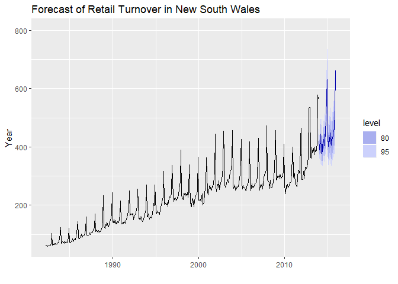<!-- -->

```r
# Check the residuals of the model
retail.ts %>% tbats() %>% checkresiduals()
```

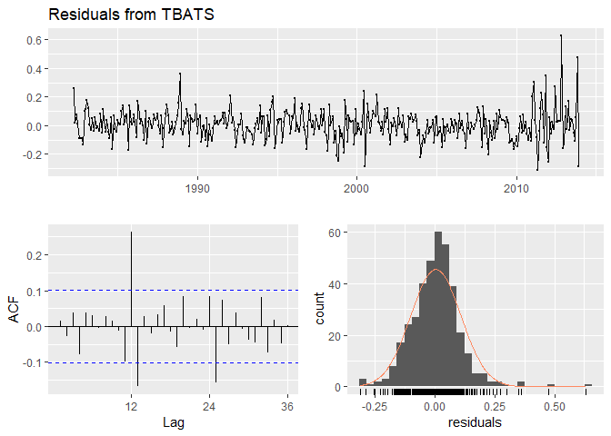<!-- -->

```
## 
## 	Ljung-Box test
## 
## data:  Residuals from TBATS
## Q* = 71.339, df = 3, p-value = 2.22e-15
## 
## Model df: 27.   Total lags used: 30
```


The completely automated approach to forecasting the data appears to produce a close predictions. Upon inspection of the residuals we see the error isn't completely white noise and observe several significant spikes in autocorrelation. I think this model could be improved with another differencing.

We appear to have saved 9 degrees of freedom.


```r
retail.ts %>% tbats()
```

```
## TBATS(0.126, {5,0}, 1, {<12,5>})
## 
## Call: tbats(y = .)
## 
## Parameters
##   Lambda: 0.125564
##   Alpha: 0.2091052
##   Beta: -0.0005633066
##   Damping Parameter: 1
##   Gamma-1 Values: -0.0005245455
##   Gamma-2 Values: 0.0004701076
##   AR coefficients: 0.146295 0.232605 -0.058188 0.266295 -0.120957
## 
## Seed States:
##               [,1]
##  [1,]  5.343529684
##  [2,]  0.009528314
##  [3,] -0.174816403
##  [4,] -0.006516769
##  [5,]  0.153792959
##  [6,] -0.093284110
##  [7,] -0.074381301
##  [8,] -0.161472998
##  [9,]  0.173701547
## [10,] -0.038564922
## [11,] -0.086664923
## [12,]  0.109858974
## [13,]  0.000000000
## [14,]  0.000000000
## [15,]  0.000000000
## [16,]  0.000000000
## [17,]  0.000000000
## attr(,"lambda")
## [1] 0.1255636
## 
## Sigma: 0.1046371
## AIC: 4114.718
```


The TBATS model that was fitted to the gasoline time series produced a TBATS(1, {0,0}, -, {<52.18,12>}) variation of the model. The model also has an AIC value of 5882.748. 


```r
# Fit tbats model to the time series
gasonline.tbats <- gasoline %>% tbats()
gasonline.tbats
```

```
## TBATS(1, {0,0}, -, {<52.18,12>})
## 
## Call: tbats(y = .)
## 
## Parameters
##   Alpha: 0.1179622
##   Gamma-1 Values: -0.001689493
##   Gamma-2 Values: 0.000923819
## 
## Seed States:
##               [,1]
##  [1,]  7.092868030
##  [2,] -0.249591452
##  [3,] -0.029197412
##  [4,] -0.083700551
##  [5,] -0.007636274
##  [6,] -0.039362634
##  [7,]  0.014557156
##  [8,]  0.045795217
##  [9,]  0.027642824
## [10,] -0.009521180
## [11,] -0.013737462
## [12,] -0.004533980
## [13,] -0.030816532
## [14,]  0.062613131
## [15,] -0.046276758
## [16,]  0.057721023
## [17,]  0.040405109
## [18,]  0.025810248
## [19,]  0.064636308
## [20,] -0.008760769
## [21,]  0.002084245
## [22,] -0.018685868
## [23,] -0.030078462
## [24,]  0.018380128
## [25,]  0.013817125
## 
## Sigma: 0.2332401
## AIC: 5882.748
```


The residuals do not appear to be similar to white noise and there are many significant spikes in the autocorrelation plot. The forecast produced from the model does not appear to have a great fit. 

These data could be modeled using a dynamic regression, specifically a harmonic regression model would deal with the trends in the data. Also, the ARIMA model would be able to minimize the residuals well. Either of these methods would work well for this time series.


```r
# Check the residuals on the plot
gasonline.tbats %>% checkresiduals()
```

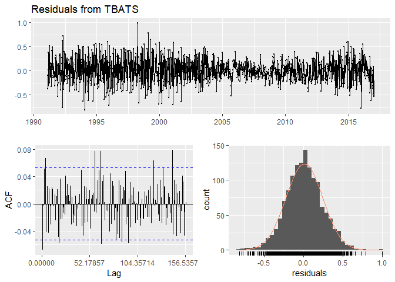<!-- -->

```
## 
## 	Ljung-Box test
## 
## data:  Residuals from TBATS
## Q* = 142.77, df = 76.357, p-value = 6.302e-06
## 
## Model df: 28.   Total lags used: 104.357142857143
```

```r
# Forecast the fitted model and plot
gasonline.tbats %>% forecast() %>% autoplot()
```

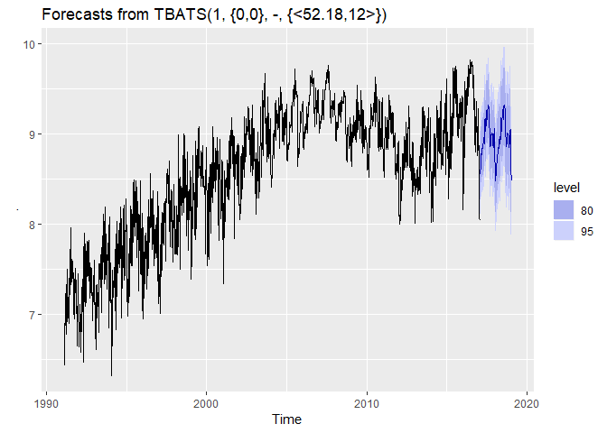<!-- -->


Bootstrapping the original data produces simulated values that appear to follow a strikingly similar trend to the original dataset. The bagged model appears to produce a weak forecast that does not follow any seasonal pattern that might be apparent from the original gasoline time series data.


```r
# Bootstrap the values of the gasoline dataset
bootseries <- bld.mbb.bootstrap(gasoline, 10) %>% as.data.frame() %>% ts(start = 1991.1, 
    frequency = 52.1785714285714)

# Plot the original series and the bootstrapped series
autoplot(gasoline) + autolayer(bootseries, colour = TRUE) + autolayer(gasoline, 
    colour = FALSE) + ylab("Millions of Gasoline Barrels Per Day") + guides(colour = "none") + 
    ggtitle("Bootstrap of US Finished Motor Gasoline Products Supplied")
```

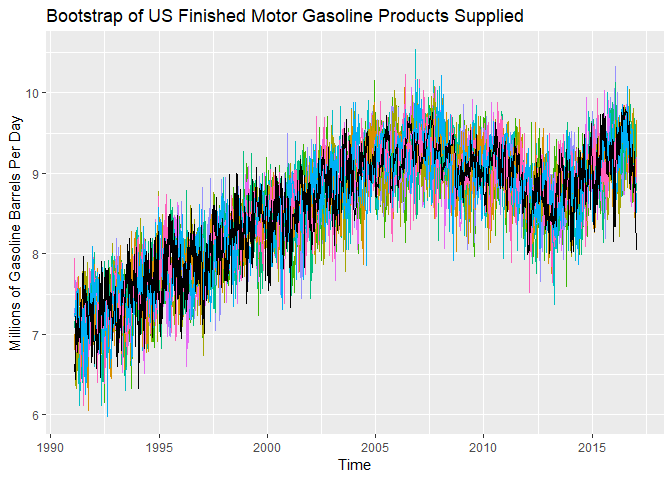<!-- -->

```r
# Bootstrap the values of the gasoline dataset
sim <- bld.mbb.bootstrap(gasoline, 10) %>% as.data.frame() %>% ts(start = 1991.1, 
    frequency = 52.1785714285714)

# Forecast the simulated series
fc <- purrr::map(as.list(sim), function(x) {
    forecast(ets(x))[["mean"]]
}) %>% as.data.frame() %>% ts(start = 1991.1, frequency = 52.1785714285714)

# Plot the bagged ets forecast
etsfc <- gasoline %>% ets() %>% forecast(h = 50)
baggedfc <- gasoline %>% baggedETS() %>% forecast(h = 50)

# Plot the original series and the bootstrapped series forecasts
autoplot(gasoline) + autolayer(baggedfc, series = "BaggedETS", PI = FALSE) + 
    autolayer(etsfc, series = "ETS", PI = FALSE) + ylab("Millions of Gasoline Barrels Per Day") + 
    guides(colour = guide_legend(title = "Forecasts")) + ggtitle("Bagged ETS Bootstrap Forecast of US Finished Motor Gasoline Products Supply")
```

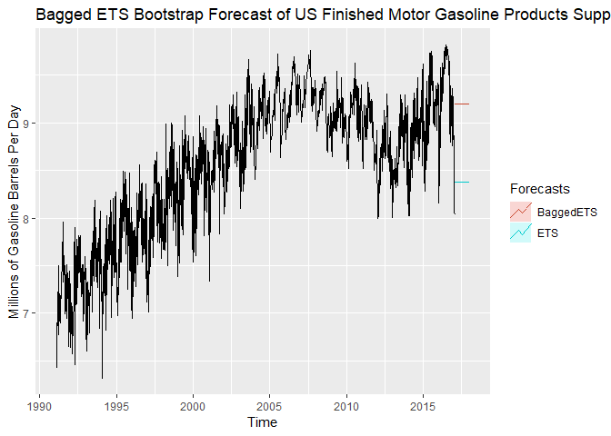<!-- -->


Producing a neaural net forecast from the retail time series appears to have values that are higher than I would have expected from an ideal forecast. These values also no not appear to follow the seasonal pattern as well, I would recommend using a different forecasting method for this dataset. The second plot, forecasting the number of women murdered each year, generated the worst plot, it does not appear to follow the cyclical nature of the initial dataset but it does begin an increasing trend which would be expected in this data. The final neural net that was run on the australian tourism data produced the best forecast, matching seasonality and trend well.


```r
# Forecast the retail demand using nnetr()
retail.ts %>% nnetar() %>% forecast() %>% autoplot() + xlab("Year") + ylab("Turnover") + 
    ggtitle("Neural Net Forecast of Retail Turnover in New South Wales")
```

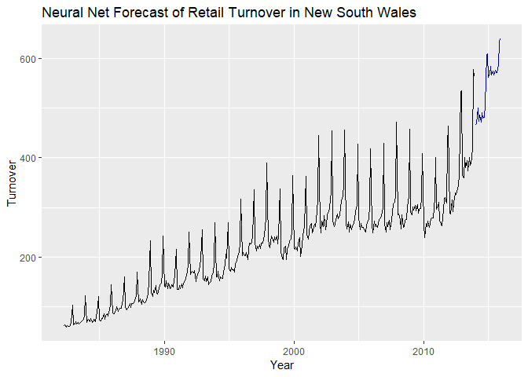<!-- -->

```r
# Forecast the wmurders time series using nnetr()
wmurders %>% nnetar() %>% forecast() %>% autoplot() + xlab("Year") + ylab("Women Murdered (per 100,000 standard population)") + 
    ggtitle("Neural Net Forecast of Number of Women Murdered Each Year")
```

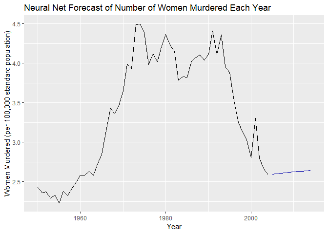<!-- -->

```r
# Forecast the austourists time series using nnetar()
austourists %>% nnetar() %>% forecast() %>% autoplot() + xlab("Year") + ylab("Number of International Tourists") + 
    ggtitle("Neural Net Forecast of Quarterly Number of International Tourists to Australia From 1999 to 2010")
```

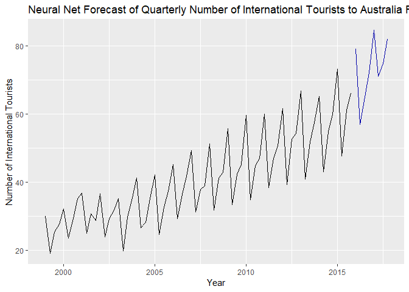<!-- -->

